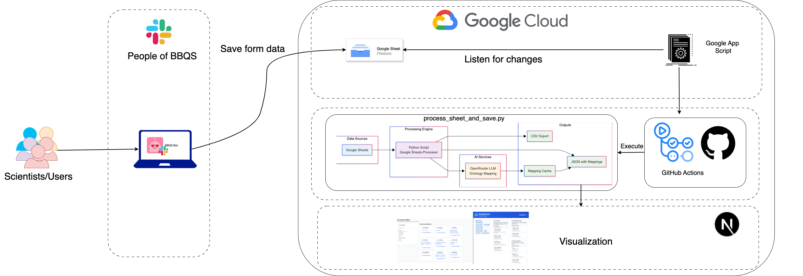

## People of BBQS

The **People of BBQS** is a project that aims to gather the expertise of those involved in the BBQS initiative, along with the knowledge they wish to learn and share.  
Essentially, it seeks to collect and disseminate this knowledge to foster collaboration, skill development, and community growth.

The initial work began during the **BBQS Unconference**, an in-person event held from **15–17 July 2025**.  
During this event, we developed the **BBQS Bot**, which automatically triggers a form when a new member joins the channel to capture their expertise.

Currently, the form collects the following information:

- **What do you do?**
- **What knowledge would you like to share?**
- **What would you like to learn?**
- **What additional information would you like to share?**
- **Submitted By**
- **Timestamp**

The work has since been extended to include the following:

1. **Normalize** the Google Sheets data and save it in CSV format.
2. **Process** the input for questions such as *"What knowledge would you like to share?"* and perform concept mapping.  
   - For example, if someone responds with:  
     > neuroinformatics, machine learning, neuroimaging, signal processing, infrastructure  
     the system maps terms like *machine learning* to their corresponding concepts in relevant schemas and ontologies (if available).
3. **Save** the processed results (JSON + normalized CSV) in `data/sheets/` directory.

## Architecture

## Todo 
- [] Improve mapping and prompts

## License
- MIT