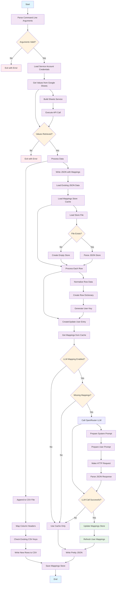

## Flow

```mermaid
flowchart TD
    A[Start] --> B[Parse Command Line Arguments]
    B --> C{Arguments Valid?}
    C -->|No| D[Exit with Error]
    C -->|Yes| E[Load Service Account Credentials]
    
    E --> F[Get Values from Google Sheets]
    F --> G{Values Retrieved?}
    G -->|No| H[Exit with Error]
    G -->|Yes| I[Process Data]
    
    I --> J[Append to CSV File]
    I --> K[Write JSON with Mappings]
    
    J --> L[Map Column Headers]
    L --> M[Check Existing CSV Keys]
    M --> N[Write New Rows to CSV]
    
    K --> O[Load Existing JSON Data]
    O --> P[Load Mappings Store Cache]
    P --> Q[Process Each Row]
    
    Q --> R[Create/Update User Entry]
    R --> S[Get Mappings from Cache]
    S --> T{LLM Mapping Enabled?}
    T -->|No| U[Use Cache Only]
    T -->|Yes| V{Missing Mappings?}
    
    V -->|No| U
    V -->|Yes| W[Call OpenRouter LLM]
    W --> X{LLM Call Successful?}
    X -->|No| U
    X -->|Yes| Y[Update Mappings Store]
    Y --> Z[Refresh User Mappings]
    
    U --> AA[Write Pretty JSON]
    Z --> AA
    N --> BB[Save Mappings Store]
    AA --> BB
    BB --> CC[End]
    
    %% Subprocess for LLM mapping
    W --> W1[Prepare System Prompt]
    W1 --> W2[Prepare User Prompt]
    W2 --> W3[Make HTTP Request]
    W3 --> W4[Parse JSON Response]
    W4 --> X
    
    %% Error handling
    F --> F1[Build Sheets Service]
    F1 --> F2[Execute API Call]
    F2 --> G
    
    %% Data processing details
    Q --> Q1[Normalize Row Data]
    Q1 --> Q2[Create Row Dictionary]
    Q2 --> Q3[Generate User Key]
    Q3 --> R
    
    %% Cache operations
    P --> P1[Load Store File]
    P1 --> P2{File Exists?}
    P2 -->|No| P3[Create Empty Store]
    P2 -->|Yes| P4[Parse JSON Store]
    P3 --> Q
    P4 --> Q
    
    %% Styling
    classDef startEnd fill:#e1f5fe
    classDef process fill:#f3e5f5
    classDef decision fill:#fff3e0
    classDef error fill:#ffebee
    classDef data fill:#e8f5e8
    
    class A,CC startEnd
    class B,E,F,I,J,K,L,M,N,O,P,Q,R,S,U,AA,BB,W1,W2,W3,W4,F1,F2,Q1,Q2,Q3,P1,P3,P4 process
    class C,G,T,V,X,P2 decision
    class D,H error
    class Y,Z data
```